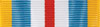
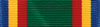
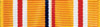
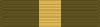
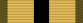
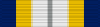
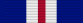
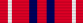
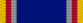
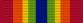

title: Awards

Awards
======
**Author:** *Phillip "[BullseyeSmith](mailto:52634333+BullseyeSmith@users.noreply.github.com)" Starke*

The standard award set provides a way to provide military honors to personnel for recognition of performance in battle, or as filler for character background stories.  They are based on real awards and decorations of the US armed forces, which have progressed over a thousand years to be the most recognized awards of all Houses and Clans throughout the known universe.  [Click here](https://en.wikipedia.org/wiki/Awards_and_decorations_of_the_United_States_Armed_Forces) to learn more about the awards and decorations of the United States Armed Forces.
________________
Associated Files
----------------
### XML File
MekHQ uses an XML file located in the `\data\universe\awards` folder to generate the list of available awards. Currently, the order of awards within the file determines both its position on the list of available awards, as well as the order they appear for everyone.  Each award entry has the following tags:

1)  `<name>` Required. The display text for the list of available awards.

2)  `<description>` Required. A brief description describing the requirements to earn the award. Will be displayed on message popup when you hover over the award name in the list of available awards.

3)  `<medal>` Optional. If award has an associated medal, provide the name of the medal image file (i.e. 'PrisonerOfWarM.png'). Add an 'M' at the end on the name to distinguish it from the associated ribbon image file. These images will appear in the 'Medals and Awards' section of the Personnel tab.

4)  `<ribbon>` Required. Provide the name of the ribbon image file (i.e. 'PrisonerOfWar.png). These images will appear beneath the individual's portrait of the Personnel tab.

5)  `<xp>` Optional. If awards warrant XP points, insert integer value. This value will appear next to the award name in parentheses in the list of available awards.

6)  `<edge>` Optional. If award warrants edge points, insert integer value. This value will appear next to the award name in parentheses in the list of available awards.

7)  `<stackable>` Optional. If award can be received more than once, insert Boolean value of 'true'.
#### \******ALL FOLLOWING TAGS ARE NOT YET IMPLEMENTED (NYI), BUT NEED TO BE INCLUDED FOR FUTURE USE\****

8)  `<position>` Required. Future versions will display list of available medals in alphabetical order, while showing ribbons and medals based on the order of precedence set by this position tag.
##### The following qty, item, size, and range tags work in conjunction with one another to allow MekHQ to provide suggested award(s) during scenario resolution and attach appropriate awards during random origin generation.

9)  `<qty>` Required. Positive whole number value.

10)  `<item>` Required. String value with no space. Reserved words include: 3SW, 4SW, AW, Civilian, Clan, Combat, Conduct, Covert, CSI, CW, Drill, Enlist, Foreign, Gunnery, Hero, Honor, House, Instructor, Jihad, Kills, Periphery, Pirates, Prisoner, Rank, RW, Security, TFS, Time, W39, W57, Wounded.

11)  `<size>` Required. List of string value with no space.  List options include Individual, Lance, Company, Battalion.

12)  `<range>` Required. List of string value with no space.  List options include Career, Mission, Scenario, Event, Months.

### Ribbon Image Files
MekHQ uses the ribbon images located in the `\data\images\awards\{XML FILE NAME}\ribbons` folder to generate the ribbons that appear beneath an individual's portrait on the Personnel tab.  Every award and medal must have a ribbon image.  Ribbon images must be in .png format with a 100 x 27 pixel ratio.  The file name must match the ribbon tag of the associated XML file award data.

### Medal Image Files
MekHQ uses the medal images located in the `\data\images\awards\{XML FILE NAME}\medals` folder to generate the medals that appear within the 'Medals and Awards' section on the Personnel tab.  Medal images must be in a transparent .png format with an 87-pixel height.  The file name must match the medal tag of the associated XML file award data, if provided.
________________
Available Awards
----------------
These awards are listed in order of precedence in accordance with the guidance found on [wikipedia](https://en.wikipedia.org/wiki/Awards_and_decorations_of_the_United_States_Armed_Forces#Order_of_precedence_2).
In relation to kill-based awards, kills are defined as the destruction of an enemy unit, or the crippling of an enemy unit, such as immobilization of vehicles or the total destruction of the leg, gyro, or engine of a mech, or the downing of an aerofighter.
The automation for the Gameplay and New Personnel is NYI.  In the interim, you can use the Award Tracker discussed in the last section of this document to assist you in awarding your existing and newly assigned personnel.

####  MEDAL OF HONOR
Distinguished oneself conspicuously by gallantry and intrepidity at the risk of life above and beyond the call of duty.

**_Gameplay:_** In real life, as of April 2020, there are 1.3 million members of the US Armed Forces on active duty.  Only two of them have received the Medal of Honor. Only 3,500 people have received the MoH since the Civil War.  Only 80 of them are still alive today.  It is usually only awarded posthumously.  Actions for consideration should involve being outnumbered by 10-to-1, suffering injuries, rescuing an ejected mechwarrior, all the while dropping four or more enemy combatants and enabling victory conditions for the scenario.  Then roll 24 on 4D6 if they survived the engagement, or 18 on 3D6 if they died in combat, to see if the decoration submission makes it through the government bureaucracy.  Combat personnel only.  In the end, use discretion, be respectful.

**_New Personnel:_** Roll a 42 with 7D6.  Must have Tour of Duty or Covert Ops as previous assignment.  Combat personnel only.

####  COMBAT CROSS
12 pilot kills in a scenario.

**_Gameplay:_** Recommended at end of scenario if pilot/driver has 12 kills.

**_New Personnel:_** Roll for a target number of 16, + gunnery skill, - 1 for each previous Tour of Duty assignment, - 2 for each previous Covert Ops assignment, on 3D6. Must have Tour of Duty or Covert Ops as previous assignment.  Combat personnel only.

####  HOUSE DISTINGUISHED SERVICE
432 battalion kills in a mission.

**_Gameplay:_** Recommended for all combat and support personnel within the battalion at end of mission if battalion has 432 kills.

**_New Personnel:_** Roll for a target number of 19, - 1 for each previous Tour of Duty assignment, - 2 for each previous Covert Ops assignment, on 3D6. Must have Tour of Duty or Covert Ops as previous assignment.

####  DISTINGUISHED SERVICE
12 pilot kills in a mission.

**_Gameplay:_** Recommended at end of mission if pilot/driver has 12 kills.

**_New Personnel:_** Roll for a target number of 10, + gunnery skill, - 1 for each previous Tour of Duty assignment, - 2 for each previous Covert Ops assignment, on 2D6. Must have Tour of Duty or Covert Ops as previous assignment.  Combat personnel only.

####  SILVER STAR
8 pilot kills in a scenario.

**_Gameplay:_** Recommended at end of scenario if pilot/driver has 8 kills.

**_New Personnel:_** Roll for a target number of 14, + gunnery skill, - 1 for each previous Tour of Duty assignment, - 2 for each previous Covert Ops assignment, on 3D6. Must have Tour of Duty or Covert Ops as previous assignment.  Combat personnel only.

####  HOUSE SUPERIOR SERVICE
144 company kills in a mission.

**_Gameplay:_** Recommended for all combat and support personnel within the company at end of mission if company has 144 kills.

**_New Personnel:_** Roll for a target number of 18, - 1 for each previous Tour of Duty assignment, - 2 for each previous Covert Ops assignment, on 3D6. Must have Tour of Duty or Covert Ops as previous assignment.

####  LEGION OF MERIT
48 lance kills in a mission.

**_Gameplay:_** Recommended for all combat and support personnel within the lance at end of mission if lance has 48 kills.

**_New Personnel:_** Roll for a target number of 14, - 1 for each previous Tour of Duty assignment, - 2 for each previous Covert Ops assignment, on 2D6. Must have Tour of Duty or Covert Ops as previous assignment.

####  ARMED FORCES
324 battalion kills in a mission.

**_Gameplay:_** Recommended for all combat and support personnel within the battalion at end of mission if battalion has 324 kills.

**_New Personnel:_** Roll for a target number of 17, - 1 for each previous Tour of Duty assignment, - 2 for each previous Covert Ops assignment, on 3D6. Must have Tour of Duty or Covert Ops as previous assignment.

####  BRONZE STAR
4 pilot kills in a scenario.

**_Gameplay:_** Recommended at end of scenario if pilot/driver has 4 kills.

**_New Personnel:_** Roll for a target number of 12, + gunnery skill, - 1 for each previous Tour of Duty assignment, - 2 for each previous Covert Ops assignment, on 3D6. Must have Tour of Duty or Covert Ops as previous assignment.  Combat personnel only.

####  PURPLE HEART
Wounded in combat due to enemy fire.

**_Gameplay:_** Recommended at end of scenario if individual was wounded during weapons attack or physical attack phase.

**_New Personnel:_** Roll for a target number of 19, - 1 for each previous Tour of Duty assignment, - 2 for each previous Covert Ops assignment, - 1 if vehicle crew, - 2 if infantry, on 3D6. Must have Tour of Duty or Covert Ops as previous assignment.  Combat personnel only.  If they have a Purple Heart, roll 2D6. On 3, they have a permanent injury (such as a prosthetic or noticeable scar).  On 2, they have a permanent disabling injury (which effects one or more of their skills).

####  HOUSE MERITORIOUS SERVICE
108 company kills in a mission.

**_Gameplay:_** Recommended for all combat and support personnel within the company at end of mission if company has 108 kills.

**_New Personnel:_** Roll for a target number of 16, - 1 for each previous Tour of Duty assignment, - 2 for each previous Covert Ops assignment, on 3D6. Must have Tour of Duty or Covert Ops as previous assignment.

####  MERITOURIOUS SERVICE
9 pilot kills in a mission.

**_Gameplay:_** Recommended at end of mission if pilot/driver has 9 kills.

**_New Personnel:_** Roll for a target number of 8, + gunnery skill, - 1 for each previous Tour of Duty assignment, - 2 for each previous Covert Ops assignment, on 2D6. Must have Tour of Duty or Covert Ops as previous assignment.  Combat personnel only.

####  COMBAT COMMENDATION
36 lance kills in a mission.

**_Gameplay:_** Recommended for all combat and support personnel within the lance at end of mission if lance has 36 kills.

**_New Personnel:_** Roll for a target number of 12, - 1 for each previous Tour of Duty assignment, - 2 for each previous Covert Ops assignment, on 2D6. Must have Tour of Duty or Covert Ops as previous assignment.

####  COMBAT ACHIEVEMENT
6 pilot kills in a mission.

**_Gameplay:_** Recommended at end of mission if pilot/driver has 6 kills.

**_New Personnel:_** Roll for a target number of 6, + gunnery skill, - 1 for each previous Tour of Duty assignment, - 2 for each previous Covert Ops assignment, on 2D6. Must have Tour of Duty or Covert Ops as previous assignment.  Combat personnel only.

####  COMBAT ACTION
Involved in combat.

**_Gameplay:_** Recommended at end of scenario if not previously awarded.

**_New Personnel:_** Must have Tour of Duty or Covert Ops as previous assignment, otherwise roll 10 or more on 2D6.  Combat personnel only.

####  HOUSE UNIT CITATION
216 battalion kills in a mission.

**_Gameplay:_** Recommended for all combat and support personnel within the battalion at end of mission if battalion has 216 kills.

**_New Personnel:_** Roll for a target number of 15, - 1 for each previous Tour of Duty assignment, - 2 for each previous Covert Ops, assignment on 3D6. Must have Tour of Duty or Covert Ops as previous assignment.

####  COMBAT UNIT COMMENDATION
72 company kills in a mission.

**_Gameplay:_** Recommended for all combat and support personnel within the company at end of mission if company has 72 kills.

**_New Personnel:_** Roll for a target number of 14, - 1 for each previous Tour of Duty assignment, - 2 for each previous Covert Ops assignment, on 3D6. Must have Tour of Duty or Covert Ops as previous assignment.

####  MERITOURIOUS UNIT COMMENDATION
24 lance kills in a mission.

**_Gameplay:_** Recommended for all combat and support personnel within the lance at end of mission if lance has 24 kills.

**_New Personnel:_** Roll for a target number of 10, - 1 for each previous Tour of Duty assignment, - 2 for each previous Covert Ops assignment, on 2D6. Must have Tour of Duty or Covert Ops as previous assignment.

####  PRISONER OF WAR
Taken prisoner during combat.

**_Gameplay:_** Recommended at end of scenario if individual is MIA.

**_New Personnel:_** Roll 4 or less on 3D6. Must have Paramilitary Service, Tour of Duty, or Covert Ops as previous assignment.

####  GOOD CONDUCT
Served 6 years of with no disciplinary action.

**_Gameplay:_** Recommended on annual rolls, computed every sixth anniversary from date of Time In Service (TIS). Deny if individual received Article 15 or Letter of Reprimand during that time frame.

**_New Personnel:_** For every six years of service, roll 2D6. On a result of 3 or more, award ribbon for that time frame.

####  EXPEDITIONARY
Partook in combat on a house world not covered by a war.

**_Gameplay:_** Recommending after Guerrilla or Extraction Raid mission for all assigned personnel.

**_New Personnel:_** Consult the Assignment Award Tables within AwardTracker.xlsx

####  HOUSE DEFENSE
Enlisted during a time of war (TOW) and Defense of a house world.

**_Gameplay:_** Recommended at end of Cadre or Garrison Duty mission on employer-controlled planet for individuals with no prior assignments.

**_New Personnel:_** Consult the Assignment Award Tables within AwardTracker.xlsx

####  GALACTIC WAR ON PIRATING
Partook in combat operations against pirates.

**_Gameplay:_** Recommended at end of mission if employed by major House against pirates.

**_New Personnel:_** Consult the Assignment Award Tables within AwardTracker.xlsx

####  HUMANITARIAN SERVICE
Defense of civilian person or structures.

**_Gameplay:_** Recommended at end of victorious scenario that required the protection of civilians without having any civilian casualties.

**_New Personnel:_** Consult the Assignment Award Tables within AwardTracker.xlsx

####  PERIPHERY EXPEDITIONARY
Partook in combat operations on a periphery world.

**_Gameplay:_** Recommended at end of mission if employed by major House against periphery world.

**_New Personnel:_** Consult the Assignment Award Tables within AwardTracker.xlsx

####  THIRD SUCCESSION WAR CAMPAIGN
Partook in  combat actions in support of the 3rd Succession War.

**_Gameplay:_** Recommended at end of mission if mission was in direct support of the specified campaign.

**_New Personnel:_** Consult the Assignment Award Tables within AwardTracker.xlsx

####  FOURTH SUCCESSION WAR CAMPAIGN
Partook in combat actions in support of the 4th succession war.

**_Gameplay:_** Recommended at end of mission if mission was in direct support of the specified campaign.

**_New Personnel:_** Consult the Assignment Award Tables within AwardTracker.xlsx

####  WAR OF 3039 CAMPAIGN
Partook in combat actions in support of the war of 3039.

**_Gameplay:_** Recommended at end of mission if mission was in direct support of the specified campaign.

**_New Personnel:_** Consult the Assignment Award Tables within AwardTracker.xlsx

####  CLAN INVASION CAMPAIGN
Partook in combat actions in support of clan invasion.

**_Gameplay:_** Recommended at end of mission if mission was in direct support of the specified campaign.

**_New Personnel:_** Consult the Assignment Award Tables within AwardTracker.xlsx

####  TASK FORCE SERPENT CAMPAIGN
Partook combat actions in support of Task Force Serpent.

**_Gameplay:_** Recommended at end of mission if mission was in direct support of the specified campaign.

**_New Personnel:_** Consult the Assignment Award Tables within AwardTracker.xlsx

####  FEDCOM CIVIL WAR CAMPAIGN
Partook combat actions in support of FedCom civil war.

**_Gameplay:_** Recommended at end of mission if mission was in direct support of the specified campaign.

**_New Personnel:_** Consult the Assignment Award Tables within AwardTracker.xlsx

####  GALACTIC SERVICE DEPLOYMENT
Served over 3 consecutive months in a foreign theatre.

**_Gameplay:_** Recommended at end of mission if mission lasted 3 months or longer, but less than 12 months, on a world outside of employer's territory.

**_New Personnel:_** Consult the Assignment Award Tables within AwardTracker.xlsx

####  GALACTIC SERVICE
Served a total of 12 months in foreign theatres.

**_Gameplay:_** Recommended at end of mission if mission lasted 12 months or longer on a world outside of employer's territory.

**_New Personnel:_** Consult the Assignment Award Tables within AwardTracker.xlsx

####  COVERT OPS
Served on a covert operations team.

**_Gameplay:_** Recommended on yearly or retirement roll if individual participated in one guerrilla campaign or two or more extraction raids.

**_New Personnel:_** Award if Covert Ops was a previous assignment.

####  LONGEVITY
Award for every 4 years of service.

**_Gameplay:_** On annual rolls, computed every forth anniversary from date of TIS.

**_New Personnel:_** For every four years of service, award ribbon for that time frame.

####  DRILL INSTRUCTOR
Served as basic training drill instructor.

**_Gameplay:_** Recommended at end of Cadre Duty mission if individual has a veteran or elite skill level and served as commander of training lance consisting of a majority of individuals with a green skill level.

**_New Personnel:_** Consult the Assignment Award Tables within AwardTracker.xlsx

####  MILITARY TRAINING INSTRUCTOR
Served as military instructor.

**_Gameplay:_** Recommended at end of non-Cadre Duty mission if individual has a veteran or elite skill level and served as commander of training lance consisting of a majority of individuals with a green skill level.

**_New Personnel:_** Consult the Assignment Award Tables within AwardTracker.xlsx

####  CEREMONIAL DUTY
Served as honor guard.

**_Gameplay:_** Recommended at the end of a Garrison Duty mission on a faction's capital planet.  Personnel that perform marriage or funeral ceremonies are also eligible.

**_New Personnel:_** Consult the Assignment Award Tables within AwardTracker.xlsx

####  SECURITY GUARD
Served as security guard.

**_Gameplay:_** Recommended at end of Security Duty mission for all assigned combat personnel, or combat personnel assigned to a non-HQ Defend role at the end of a non-Security Duty mission.

**_New Personnel:_** Consult the Assignment Award Tables within AwardTracker.xlsx

####  OFFICER GRADUATE
Graduate of OCS or equivalent.

**_Gameplay:_** Requires status changed to "retired" for 4 years as they attend OCS.  They return with the rank rate of O1 or the field promotion rank they received prior to leaving for training, whichever is higher.  Graduate receives +1 in tactics, strategy, or leadership (player's choice).  Graduation skill modifiers: green returns with -2 to piloting and gunnery, regular returns with -1 to piloting and gunnery, veteran return with -1 to piloting or gunnery (player's choice), elite returns with -1 to piloting or gunnery (whichever is higher). Warrant Officers are ineligible. Can only award once.

**_New Personnel:_** Award if Rank Rate is O1 or higher.

####  WARRANT OFFICER GRADUATE
Graduate of warrant officer training.

**_Gameplay:_** Requires status changed to "retired" for 2 years as they attend WOT.  They return with the rank rate of WO1 or the field promotion rank they received prior to leaving for training, whichever is higher.  Graduation skill modifiers: green returns with -1 to piloting and gunnery, regular returns with -1 to piloting or gunnery (player's choice), veteran return with -1 to piloting or gunnery (flip a coin), elite returns with -1 to piloting or gunnery (whichever is higher).  Officers are ineligible. Can only award once.

**_New Personnel:_** Award if Rank Rate is WO1 through WO10.

####  NCO ACADEMY GRADUATE
Graduate of NCO academy.

**_Gameplay:_** Requires status changed to "retired" for 3 months as they attend NCOA.  They return with the rank rate of E10 or the field promotion rank they received prior to leaving for training, whichever is higher.  Graduation skill modifiers: regular returns with -1 to piloting or gunnery (whichever is higher), veteran returns with +1 in tactics, strategy, or leadership (player's choice), elite returns with +1 in tactics, strategy, or leadership (see table below).  Non-Ranked personnel, Enlisted with green skill level, Warrant Officers, and Officers are ineligible. Can only award once.

|Elite NCOA Skill|1D6|
|----------------|:-:|
|Tactics         |1-2|
|Strategy        |3-4|
|Leadership      |5-6|

**_New Personnel:_** Award if Rank Rate is E10 through E20.

####  BASIC TRAINING
Graduate of basic training.

**_Gameplay:_** Recommended at end of mission if non-ranked individual was a green member of a training lance.  Promote to second lowest enlisted rank and apply -1 to piloting or gunnery (whichever is higher) for Cadre mission.  Promote to lowest enlisted rank for non-Cadre mission. Can only award once.

**_New Personnel:_** Award if Rank Rate is E1 or higher.

####  EXPERT MARKMANSHIP
Gunnery Skill of 1 or 0.

**_Gameplay:_** Recommended on annual rolls if Gunnery Skill is 1 or less and not already awarded.

**_New Personnel:_** Award if Gunnery Skill is 1 or less.

####  MARKMANSHIP
Gunnery Skill of 3 or 2.

**_Gameplay:_** Recommended on annual rolls if Gunnery Skill is 3 or less and not already awarded.

**_New Personnel:_** Award if Gunnery Skill is 3 or less.
_____________
Award Tracker
-------------
In the future, MekHQ will automatically calculate eligibilities for awards and present their recommendations at the appropriate times.  Until then, I have created `\docs\Award Stuff\AwardTracker.xlsx` with a PowerPivot Table that can be used to import campaign info saved to `\docs\Award Stuff\CampaignDataForAwards.cpnx` to see what kill-based awards have been earned for individuals, lances, companies, and battalions, as long as your TO&E is arranged by battalions, companies, lances, and units.

It also includes a _RANDOM ORIGIN GENERATOR_ to quickly create back stories for new personnel, as well as _ASSIGNMENT AWARD TABLES_ to determine appropriate awards based on their previous assignments.  This will also be automated into MekHQ somewhere down the line.
